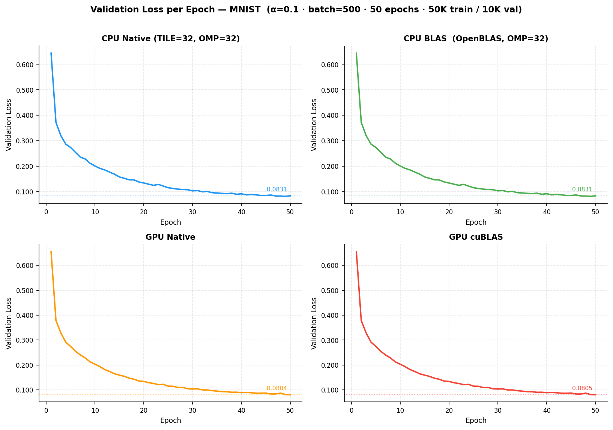
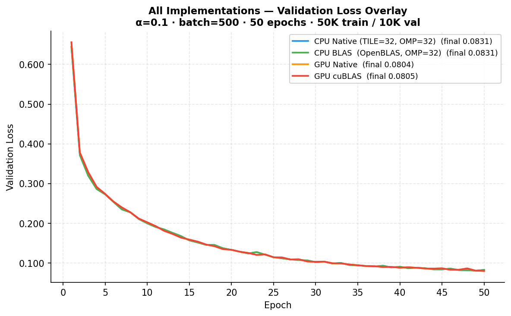

# Project 3 — Milestone 3 Report

## Name: Adithya Suresh, cnetID: adii

## Performance Benchmarks

α = 0.1, batch = 500, 50 epochs, Midway3 cluster.
CPU: caslake partition (Intel Xeon, 32 cores). GPU: A100 (sm_70 binary).
Train/val split: 50K training, 10K validation.

| Version | Tile Size | Core Count | Time to Solution (s) | Grind Rate (smp/s) | Accuracy (%) |
|---|---|---|---|---|---|
| CPU Native | 32 | 32 | 39.53 | 63,244 | 97.62 |
| CPU BLAS   | N/A | 16 | 24.31 | 102,857 | 97.62 |
| GPU Native | N/A | N/A | 6.71 | 372,419 | 97.71 |
| GPU cuBLAS | N/A | N/A | 7.19 | 347,523 | 97.71 |

---

## Validation Loss Curves

---

## Notes

**Parameters:**
784 → 128 (ReLU) → 256 (ReLU) → 10 (Softmax). SGD, α=0.1, batch=500, 50 epochs. All four implementations converge to the same validation loss (~0.081–0.083) and accuracy (~97.6–97.7%).

**Tile size:**
TILE=32 was optimal for the problem size.

**CPU Native thread scaling:**
32 threads (39.53s) was about 7.5% faster than 16 threads (42.67s). Gains are modest because the GEMM matrices are small (max 256×784) and synchronization overhead limits further scaling.

**CPU BLAS thread scaling:**
16 threads (24.31s) was about 1.76× faster than native. Scaling to 32 threads slightly degrades (24.81s).

**GPU Native:**
5.9× faster than best CPU native, 3.6× faster than best OpenBLAS. One thread per output element, 16×16 blocks for 2D kernels, 256 threads for 1D kernels.

**GPU cuBLAS vs GPU Native:**
cuBLAS (7.19s) is ~7% slower than the naive kernel (6.71s). For this network (max GEMM dim 256×784), `cublasSgemm` per-call dispatch overhead (~10–50 μs × ~25,000 calls) exceeds any kernel-level gain.

**cuBLAS scaling experiment (784 → 512 → 1024 → 10):**
At larger hidden sizes, GPU cuBLAS (8.6s) outperforms GPU native (14.7s) by 1.71×. Once GEMM dimensions exceed ~512, cuBLAS's tiled SGEMM the dispatch overhead becomes negligible.
